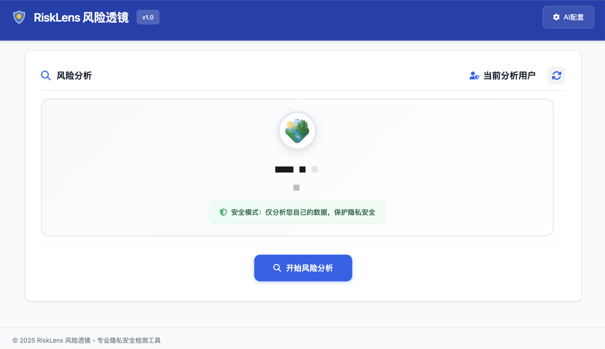

<div align="center">

# 🔍 RiskLens 风险透镜

</div>

<div align="center">


**Linux.do 社区专用的个人信息泄露风险分析工具**

*基于AI技术，自动分析您的发言内容，识别潜在的隐私泄露风险*

[安装使用](#-安装使用) • [功能特点](#-功能特点) • [常见问题](#-常见问题)

</div>

---

## 🌟 项目简介

RiskLens 风险透镜是一款专门为 **linux.do** 社区用户开发的Chrome浏览器扩展。它能够智能分析您在linux.do上的发言内容，识别可能泄露的个人信息，帮助您及时发现和预防隐私风险。

### 🎯 主要用途

在linux.do社区中，用户经常分享技术经验、生活感悟，但可能无意中暴露：
- 📧 邮箱地址、QQ号等联系方式
- 📱 手机号码、微信号等通讯信息  
- 🏠 具体的地理位置、住址信息
- 💳 支付信息、银行相关内容
- 🆔 真实姓名、身份证等敏感信息

RiskLens 帮助您**提前发现**这些风险，**保护个人隐私**。

---

## ✨ 功能特点

### 🤖 智能AI分析
- **多模型支持**: 兼容 OpenAI GPT、Claude、通义千问等主流AI模型
- **安全分析**: 仅分析您自己的数据，保护隐私安全
- **流式显示**: 实时展示AI分析过程，过程透明
- **批量处理**: 自动分批处理大量历史发言内容

### 📊 风险评估报告  
- **量化评分**: 0-100分的风险评分系统
- **风险分级**: 🟢低风险、🟡中风险、🔴高风险
- **详细分析**: 具体说明发现的风险点和改进建议
- **打印导出**: 支持风险报告的导出和打印

### 🎨 简洁界面
- **专业设计**: 现代化的用户界面，操作简单
- **实时反馈**: 详细的分析进度显示
- **一键分析**: 登录linux.do后一键开始分析

---

## 🖼️ 界面预览

<div align="center">

### 🏠 主界面

*简洁现代的用户界面，支持一键分析*

### 📊 评估结果

*详细的风险评分和量化分析*

### 🔍 风险发现

*智能识别潜在的隐私泄露风险点*

### 🛡️ 安全建议

*针对性的隐私保护改进建议*

</div>

---

## 📥 安装使用

### 快速安装

1. **下载源码**
   ```bash
   git clone https://github.com/BeeThor/RiskLens.git
   # 或直接下载ZIP文件并解压
   ```

2. **安装到Chrome**
   - 打开Chrome浏览器，访问 `chrome://extensions/`
   - 开启右上角的「开发者模式」
   - 点击「加载已解压的扩展程序」
   - 选择下载的RiskLens文件夹

3. **配置AI服务**
   - 点击扩展图标，进入配置页面
   - 填写AI模型信息（API地址、密钥等）
   - 测试连接确保配置正确

4. **开始使用**
   - 登录 [linux.do](https://linux.do) 网站
   - 点击扩展图标，系统自动识别当前用户
   - 点击「开始风险分析」即可

### 使用方法

1. **登录linux.do**: 在浏览器中打开linux.do网站并登录您的账户
2. **打开扩展**: 点击浏览器工具栏中的RiskLens图标
3. **自动识别**: 系统会自动识别当前登录的用户信息
4. **开始分析**: 点击「开始风险分析」按钮
5. **查看报告**: 等待分析完成，查看详细的风险评估报告（预防最大token限制，系统会按照每500条回帖为一轮次分析）

### 风险等级说明

| 风险等级 | 评分范围 | 说明 |
|---------|----------|------|
| 🟢 低风险 | 0-39分 | 信息相对安全，无明显泄露风险 |
| 🟡 中风险 | 40-69分 | 存在一定风险，建议关注并改进 |
| 🔴 高风险 | 70-100分 | 发现明显风险，建议立即处理 |

---

## 🛡️ 隐私安全

### 🔒 安全保障
- **仅分析自己**: 系统严格限制只能分析当前登录用户自己的数据
- **本地处理**: 数据分析在本地浏览器中进行，不会上传个人信息
- **临时存储**: 分析数据仅临时存储，完成后自动清除
- **加密传输**: 与AI服务的通信采用HTTPS加密

### ⚖️ 使用规范
- ✅ 仅用于分析自己的linux.do账户
- ✅ 遵守linux.do社区使用条款
- ✅ 合理使用，避免频繁请求
- ❌ 禁止用于恶意目的

### 📁 项目结构
```
RiskLens_风险透镜/
├── manifest.json          # 扩展配置
├── dashboard.html         # 主界面
├── dashboard.js           # 主逻辑
├── dashboard-styles.css   # 界面样式
├── content.js             # 内容脚本
├── background.js          # 后台服务
├── icons/                 # 图标资源
└── README.md              # 项目文档
```

---

## ❓ 常见问题

**Q: 扩展安装后无法使用？**  
A: 请检查Chrome版本是否88+，确保开启开发者模式，并重新加载扩展。

**Q: AI配置一直失败？**  
A: 检查API密钥格式是否正确，API地址是否有误，网络连接是否正常。

**Q: 分析失败或结果不准确？**  
A: 确认AI配置正确，API余额充足，网络稳定。分析结果受AI模型能力影响，建议结合人工判断。

**Q: 是否会泄露我的数据？**  
A: 工具仅在本地分析您自己的数据，不会上传个人信息到第三方服务器，分析完成后数据自动清除。

**Q: 可以分析其他人的账户吗？**  
A: 不可以。系统设有安全限制，只能分析当前登录用户自己的数据，保护用户隐私。

---

## 🙏 致谢

- **linux.do社区** - 提供数据接口支持
- **AI服务提供商** - 智能分析能力
- **Chrome Extensions API** - 浏览器扩展框架

---

<div align="center">

**🔍 RiskLens 风险透镜 - 保护您的网络隐私安全**

*如果这个项目对您有帮助，请给个 ⭐ Star！*

**项目地址**: [https://github.com/BeeThor/RiskLens](https://github.com/BeeThor/RiskLens)

</div>

---

**⚠️ 免责声明**: 本工具仅用于个人隐私安全检测，请合理使用并遵守相关法律法规。分析结果仅供参考。
